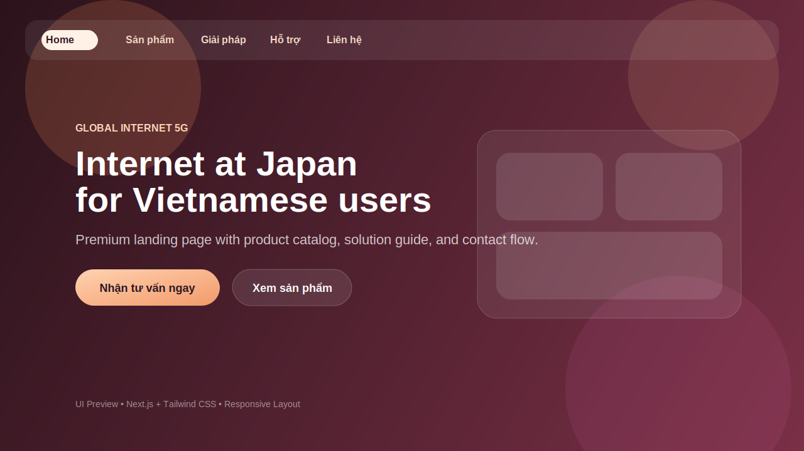

# Global Internet 5G (taoweblan11)

Landing page/product-site built with **Next.js App Router + Tailwind CSS** for a telecom consulting brand in Japan.

## Preview


## Project Goal
- Practice building a premium responsive interface with modern frontend stack.
- Organize a clear customer flow: `Home -> Product -> Solution -> Contact`.
- Keep content business-friendly and easy to present to clients/management.

## Tech Stack
- **Framework:** Next.js 15 (App Router)
- **UI:** React 19 + Tailwind CSS
- **Language:** TypeScript
- **Icons:** lucide-react

## Key Features
- Multi-page marketing website with product detail pages (`/san-pham/*`).
- Responsive navigation with product dropdown and mobile menu.
- Structured SEO setup: metadata, `robots.ts`, `sitemap.ts`, JSON-LD.
- Contact form with real API submission (`/api/contact`) and validation.
- Production UX fallback pages: `not-found.tsx` and `error.tsx`.

## Project Structure
```text
app/           # Routes, layouts, API routes
components/    # Reusable UI blocks
data/          # Static content (navigation, products, FAQ)
lib/           # Shared business/validation logic
docs/          # Readme assets (preview image)
```

## Getting Started
```bash
npm install
npm run dev
```
Open [http://localhost:3000](http://localhost:3000).

## Scripts
```bash
npm run dev     # start development server
npm run build   # build production bundle
npm run start   # run production server
npm run lint    # lint project
```

## Deployment
### Recommended: Vercel
1. Push source code to GitHub.
2. Import repository in Vercel.
3. Framework preset: **Next.js** (auto-detected).
4. Deploy.

### About GitHub Pages
This project currently includes a server route (`/api/contact`), so **GitHub Pages is not suitable** unless you remove server features and convert to static export.

## Naming Note
`taoweblan11` is a practice-series name. For portfolio/CV usage, consider renaming to a product-style repo name, for example:
- `global-internet-5g-site`
- `japan-internet-consulting-landing`

## Author
Built by `nhuhung1995` as a frontend practice and product presentation project.
